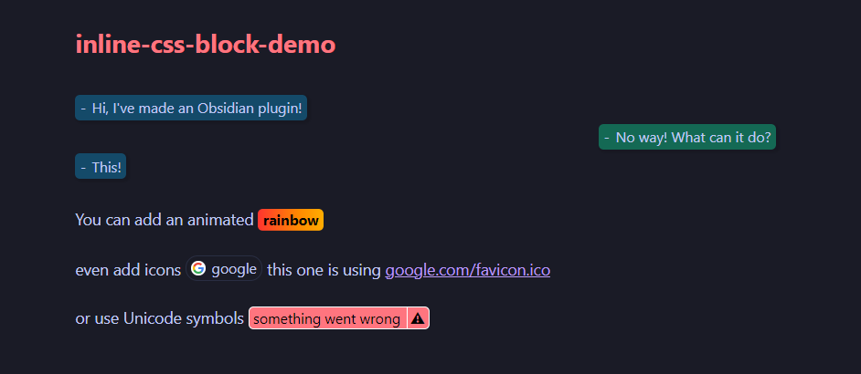
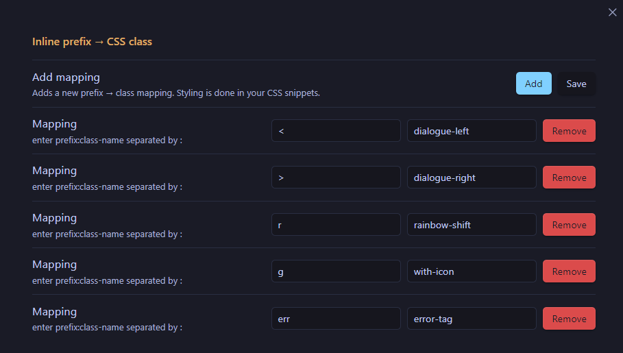

# Obsidian Inline code css



# Installation
1. Download the latest release from [Releases](https://github.com/myaxislost/obsidian-inline-code-css/releases)
2. Unpack it into your vault .obsidian/plugin folder
3. Enable it in the `Community Plugin` settings


# Settings


1. Add prefix and css class name you wish to use for this prefix
2. Click save
3. Done!

Now once you type \`<:Some text here\` it would automatically use the corresponding css class from your css snippets

# Explanation
On rendering the plugin replaces you \`<:Example\` with
```html
<span>
  <span class="inline-widget ...">
    Example
  </span>
</span>
```
So you can do pretty much anything with css these days, here's the dialogue example from the demo:
```css
.dialogue-left,
.dialogue-right {
  color: var(--text-normal);
  font-weight: 400;
  max-width: 50%;
  padding: 2px 5px;
  box-shadow: rgba(0, 0, 0, 0.1) 2px 2px 2px 2px;
}
.dialogue-right::before,
.dialogue-left::before {
  content: "-";
  font-weight: 400;
}

.dialogue-left {
  background-color: #144a69;
}

.dialogue-right {
  align-items: end;
  background-color: #146954;
}

span:has(.dialogue-left),
span:has(.dialogue-right) {
  display: inline-flex;
  width: 100%;
  margin-bottom: 4px;
}

span:has(.dialogue-right) {
  justify-content: end;
}

```

More examples [here](https://github.com/myaxislost/obsidian-inline-code-css/tree/main/css-examples)
